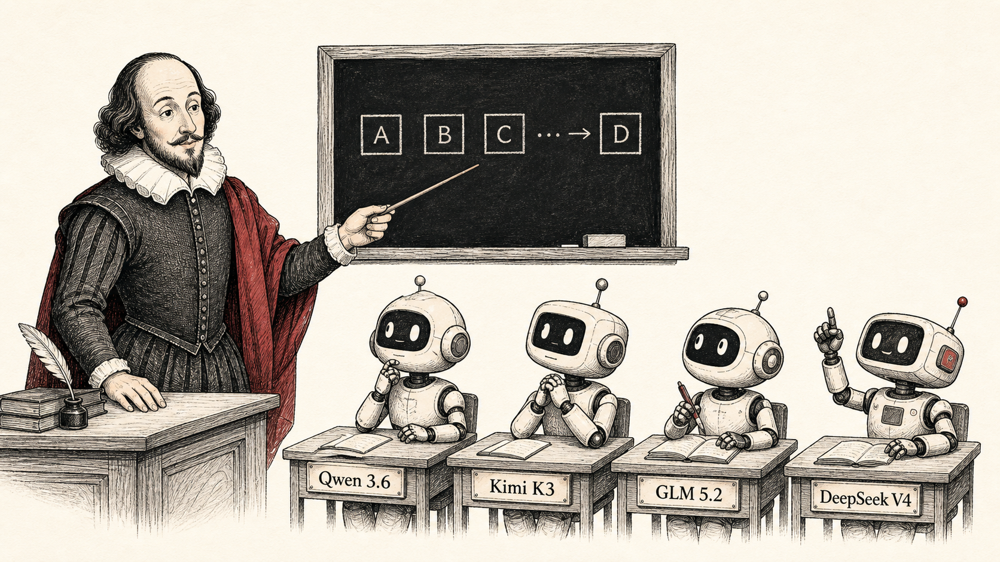

# smollms



Tiny, inspectable language models for learning what modern LLM architecture
ideas actually change.

The project trains Qwen-style dense, Kimi-style, GLM-style, and DeepSeek
V4-style toy decoders on Tiny Shakespeare. It is not a frontier-model
reproduction or a benchmark leaderboard.

Start with the [architecture lab chapter](docs/architecture-lab.md). It explains
the dense control, each branch, what is deliberately omitted, and how to make a
comparison that means something. See [recorded results](docs/results.md) for
the actual run artifacts and their limits. For a paper-style read, open the
[published experiment report](https://taruntomar122.github.io/smollms/).

## Quick start

```bash
python3 -m venv .venv
source .venv/bin/activate
python -m pip install -e ".[dev]"
pytest -q

# Train the Qwen-style dense control. Every run records its seed and config.
python -m smollms.train \
  --arch dense --data data/tinyshakespeare.txt --steps 500 \
  --seed 1337 --run-name first-dense
```

Then generate text from the logged checkpoint:

```bash
python -m smollms.infer -c runs/<run_id>/checkpoint.pt -p "To be" -n 300
```

## Architecture map

| Branch | What changes | Entry point |
|---|---|---|
| Dense / Qwen-style | full attention + SwiGLU control | [`smollms/model.py`](src/smollms/model.py) |
| Kimi-style | LatentMoE, KDA/Gated MLA hybrid, AttnRes | [`variants/kimi`](src/smollms/variants/kimi/README.md) |
| GLM-style | learned top-k token selection + routed MoE | [`variants/glm`](src/smollms/variants/glm/README.md) |
| DeepSeek V4-style | local raw context + compressed memory, then MoE | [`variants/deepseek_v4`](src/smollms/variants/deepseek_v4/README.md) |

## Run and compare experiments

Each run writes arguments, effective model config, corpus fingerprint, metrics,
samples, plot, summary, and checkpoint under `runs/<run_id>/`.

```bash
# Re-run the controlled story suite. Use CPU for the most reproducible local run.
SEED=1337 DEVICE=cpu STEPS=2000 sh scripts/train_story_suite.sh

# Compare two saved artifacts.
python -m smollms.compare runs/<run_a> runs/<run_b>
```

The suite measures evidence, not a winner. Architecture branches have different
parameter and active-compute profiles; compare only the controlled pairs in the
[chapter](docs/architecture-lab.md#6-how-an-experiment-becomes-evidence).

## Repository guide

```text
src/smollms/atoms/       small, independently tested building blocks
src/smollms/blocks/      dense Transformer block
src/smollms/variants/    architecture branches and their READMEs
src/smollms/train.py     training and run-artifact writer
src/smollms/infer.py     checkpoint loading and generation
src/smollms/compare.py   run comparison CLI
docs/                    one chapter and evidence-backed results
runs/                    committed experiment artifacts
tests/                   causality, shape, and smoke checks
```
