# smollms: frontier LLM ideas, small enough to inspect

`smollms` is a learning lab, not a benchmark or a paper-reproduction project.
It asks one question:

> Which design ideas from modern LLMs still teach us something when the model is
> small enough to read, train, and break on a laptop?

Every model predicts the next character in Tiny Shakespeare. The point is not
to generate convincing Shakespeare. The point is to change one component,
inspect the saved run, and understand the tradeoff.

## Read this repository in this order

1. Run the [dense baseline](#1-the-control-a-small-dense-decoder).
2. Read the architecture branch that changes one assumption.
3. Compare only runs whose configs answer the same question.
4. Read [the recorded results](results.md) before making a performance claim.

The implementation is deliberately small. Production kernels, distributed
training, large tokenizers, and decode caches are out of scope until a lesson
needs one.

## 1. The control: a small dense decoder

The baseline is a Qwen-style dense decoder at the block level:

```text
token ids
  -> token embedding
  -> [ RMSNorm -> causal attention -> residual
       RMSNorm -> SwiGLU FFN      -> residual ] x N
  -> RMSNorm -> tied output embedding -> next-character logits
```

The useful pieces are ordinary and worth learning before sparsity:

- **Residual stream:** each block writes an update instead of replacing its
  input. This gives later layers access to earlier representations.
- **RMSNorm:** pre-normalization keeps the stream stable without subtracting
  its mean.
- **Causal attention:** a token reads only itself and earlier tokens. Multi-head
  attention mixes information across positions.
- **RoPE:** positional information rotates queries and keys, making their dot
  product depend on relative offset. It does not change the token embedding.
- **GQA and QK-Norm:** practical Qwen-style details included in the baseline;
  grouped query heads reduce K/V width and QK normalization improves stability.
- **SwiGLU:** the dense channel mixer transforms each token independently after
  attention has mixed information across positions.

Start here:

```bash
python -m smollms.train \
  --arch dense --data data/tinyshakespeare.txt --steps 2000 \
  --seed 1337 --run-name dense-control
```

Code: [`src/smollms/model.py`](../src/smollms/model.py),
[`src/smollms/blocks/transformer.py`](../src/smollms/blocks/transformer.py), and
[`src/smollms/atoms/`](../src/smollms/atoms/).

## 2. What each branch changes

| Branch | Question | Keep fixed | Change |
|---|---|---|---|
| Dense / Qwen-style | Is the ordinary decoder a strong control? | data, width, depth, optimizer | nothing |
| Kimi-style | Can latent routing and recurrent/latent token mixers replace parts of a dense block? | Kimi width, depth, MoE | token-mixer schedule |
| GLM-style | Is learned sparse selection useful in this toy? | MoE, width, depth | DSA vs dense attention |
| DeepSeek V4-style | Can local raw context plus compressed old context retain enough information? | width, depth, data | attention layout; then FFN vs MoE |

These are architectural *ideas*, not claims of equivalence to the cited
frontier models.

## 3. Kimi-style: route channels, then alter the token mixer

Kimi has two separate ideas in this lab.

### Step 1: LatentMoE

The dense SwiGLU FFN becomes a small routed mixture of experts:

```text
residual stream -> latent projection -> top-k experts + shared expert
                -> output projection -> residual update
```

Routing happens in a smaller latent space. A load-balance loss prevents every
token from collapsing onto one expert. Attention stays ordinary causal
attention, so this is the clean channel-mixer experiment.

### Step 2: KDA, Gated MLA, and AttnRes

The next experiment changes the token mixer too:

- **Kimi Delta Attention (KDA):** a causal recurrent state reads its current
  prediction, writes only the error, and can overwrite a value at the same key.
- **Gated MLA:** queries remain direct, while a compact latent reconstructs K/V
  representations for the full-attention slots.
- **Hybrid pattern:** `3L1F` means three KDA layers then one Gated MLA layer;
  `1L1F` alternates them; `all_full` is a real full-attention control.
- **AttnRes:** the current token chooses useful earlier depth states, rather
  than blindly adding only the previous block output.

Run a controlled schedule comparison:

```bash
python -m smollms.train --arch kimi2 --hybrid-pattern all_full --attn-res false \
  --data data/tinyshakespeare.txt --steps 2000 --seed 1337 --run-name kimi-full
python -m smollms.train --arch kimi2 --hybrid-pattern 1L1F --attn-res false \
  --data data/tinyshakespeare.txt --steps 2000 --seed 1337 --run-name kimi-1l1f
```

The KDA loop is intentionally direct Python for short contexts. It is causal
and readable, not a throughput implementation.

Code: [`src/smollms/variants/kimi/`](../src/smollms/variants/kimi/).

## 4. GLM-style: select tokens, then read them

Dense attention compares every query with every earlier token. The GLM toy
separates selection from reading:

```text
indexer scores causal positions -> keep top k -> ordinary attention over kept K/V
```

The indexer score is added to the selected attention logits so it receives a
learning signal, but the `top_k` boundary remains hard. The channel mixer has
one dense SwiGLU prefix layer, then sigmoid-routed experts plus a shared expert.
A stored correction bias nudges future selections away from overused experts
without adding an auxiliary loss to language-model loss.

The correct experiment is not GLM vs dense. It is the same GLM channel mixer
with two token mixers:

```bash
python -m smollms.train --arch glm --glm-attention sparse --glm-dense-layers 1 \
  --data data/tinyshakespeare.txt --steps 2000 --seed 1337 --run-name glm-dsa
python -m smollms.train --arch glm --glm-attention dense --glm-dense-layers 1 \
  --data data/tinyshakespeare.txt --steps 2000 --seed 1337 --run-name glm-dense-attn
```

This toy still materializes a dense `T x T` index matrix. It demonstrates the
selection data flow; it does not demonstrate sparse-attention speed.

Code: [`src/smollms/atoms/sparse_attention.py`](../src/smollms/atoms/sparse_attention.py)
and [`src/smollms/variants/glm/`](../src/smollms/variants/glm/).

## 5. DeepSeek V4-style: preserve nearby detail, compress the prefix

The V4 toy divides earlier context into three disjoint regions:

```text
completed old chunks  -> learned compressed memory
partial boundary     -> raw K/V
recent local window  -> raw K/V
```

No token is dropped and no token is represented twice. A query reads its local
raw window and the combined compressed-memory/boundary branch. This is the
smallest useful form of local-plus-compressed attention.

The second experiment changes only the channel mixer. `--v4-moe mixed` uses a
fixed token-ID hash routing rule in the first layer, then learned routed MoE in
later layers. Dense SwiGLU is the control.

```bash
python -m smollms.train --arch deepseekv4 --v4-moe dense \
  --data data/tinyshakespeare.txt --steps 2000 --seed 1337 --run-name v4-dense
python -m smollms.train --arch deepseekv4 --v4-moe mixed --v4-hash-moe-layers 1 \
  --data data/tinyshakespeare.txt --steps 2000 --seed 1337 --run-name v4-moe
```

The model reads every compressed entry and materializes dense masks. It is not
Compressed Sparse Attention, a long-context speed benchmark, or production V4.

Code: [`src/smollms/variants/deepseek_v4/`](../src/smollms/variants/deepseek_v4/).

## 6. How an experiment becomes evidence

Every run is an inspectable folder:

```text
runs/<run_id>/
  train_args.json     exact command settings, including seed
  model_config.json   effective model configuration and parameter count
  data_info.json      corpus fingerprint and split sizes
  metrics.jsonl       append-only train/validation events
  samples.json        generated text snapshots
  summary.json        final and best validation losses, wall time
  plots/loss_curves.png
  checkpoint.pt       model, config, and character vocabulary
```

Use the effective configuration, not assumptions about defaults. In particular,
`--arch kimi2` defaults to `3L1F`, while an explicit `--hybrid-pattern all_full`
is preserved for the control.

Compare saved runs with:

```bash
python -m smollms.compare runs/<run_a> runs/<run_b>
```

Before comparing losses, require the same corpus fingerprint, seed, block size,
width, depth, optimizer settings, steps, and device. Parameter count and wall
time are measurements, not things to normalize away. MoE active-compute parity
is not calculated automatically, so state it explicitly.

## 7. The current story

The first completed runs show that every branch trains, but they are not one
leaderboard. The most useful existing result is the GLM ablation: with the same
corrected MoE, dense attention beat this tiny DSA implementation. That is a
finding about this implementation and 64-character Shakespeare setup, not a
claim about GLM at scale.

The next evidence to add is deliberately boring:

1. Run each row in the controlled suite with the same recorded seed.
2. Repeat promising comparisons across multiple seeds.
3. Keep the result table honest about parameter and active-compute differences.
4. Change one component only after the previous comparison has an answer.

See [results.md](results.md) for the exact historical run IDs and numbers.

## 8. What this repository does not claim

- It does not reproduce Qwen, Kimi, GLM, or DeepSeek checkpoints.
- It does not measure production inference cost, long-context throughput, or
  scaling laws.
- It does not include BPE tokenization, fused kernels, distributed routing,
  cache-aware decoding, or training at useful language-model scale.

Those omissions make the implementation legible. Add one only when it serves a
new experiment with a clear expected observation.

---

# Part II — the architecture lessons

This is the detailed path through the code. Read it top to bottom once, then
return to the branch you are changing. Every diagram names the tensor or state
that actually exists in this repository.

## Lesson A — the residual stream is the model's shared workspace

At every layer, each token has one vector of width `D`:

```text
x: (batch, sequence, d_model) = (B, T, D)
```

The residual stream is not replaced by attention or the FFN. A sublayer reads
the stream, computes an update of exactly the same shape, and adds it back.

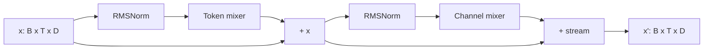

The two operations are:

```text
x <- x + token_mixer(RMSNorm(x))
x <- x + channel_mixer(RMSNorm(x))
```

Why this matters:

- Addition gives gradients a direct route through depth.
- Each component has a simple contract: read a normalized stream, return a
  same-shaped update.
- Architecture variants can swap the token mixer or channel mixer without
  changing the rest of the model.

`smollms.atoms.residual.residual_add` deliberately does only the addition. The
interesting behavior belongs in the module that produces the update.

### RMSNorm

RMSNorm scales each token's feature vector without centering it:

```text
rms(x) = sqrt(mean(x^2) + eps)
RMSNorm(x) = weight * x / rms(x)
```

The mean is over the last dimension only. A batch item or token never changes
another token's normalization. This lab uses **pre-norm**, meaning normalization
happens before each sublayer. The implementation is
[`atoms/norm.py`](../src/smollms/atoms/norm.py).

## Lesson B — tokens become vectors before positions enter

The character tokenizer maps a character to an integer. `TokenEmbedding` then
looks up one row in a learned table:

```text
input_ids: (B, T) integers
embedding table: (vocab_size, D)
stream: (B, T, D)
```

Two equal token IDs produce equal vectors, even if they occur at different
positions. Position is introduced later inside attention, not in the embedding
table. The final language-model head shares the same weights as the embedding
table:

```text
logits = hidden @ embedding_weight.T
```

That is weight tying. It lowers parameter count and makes input/output token
representations share one table.

Code: [`data/char_data.py`](../src/smollms/data/char_data.py) and
[`atoms/embed.py`](../src/smollms/atoms/embed.py).

## Lesson C — dense causal attention is the control token mixer

Attention lets one token read earlier positions. For each head:

```text
q_i = Wq x_i                 what position i is looking for
k_j = Wk x_j                 what position j contains
v_j = Wv x_j                 what position j can write

score(i, j) = q_i dot k_j / sqrt(head_dim)
weight(i, :) = softmax(score(i, :), only j <= i)
output_i = sum_j weight(i, j) * v_j
```

The causal condition `j <= i` is the language-model boundary. If changing a
future input changes an earlier output, the layer is wrong. The causality tests
in this repository check exactly that property.

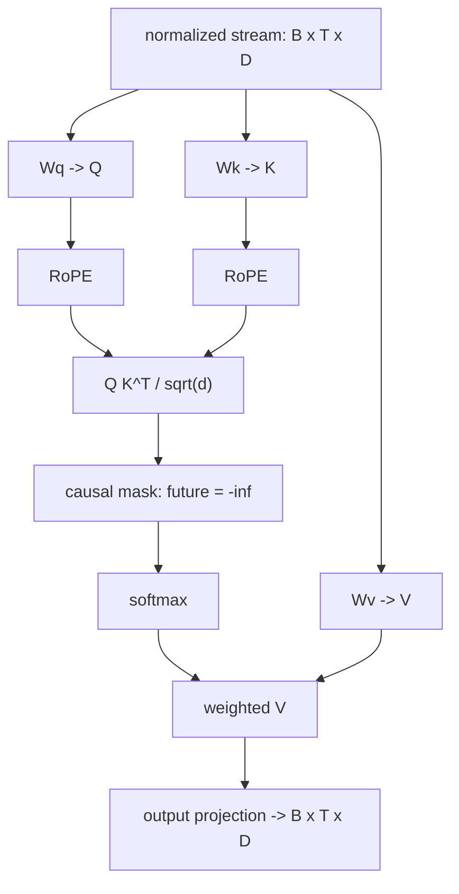

### Multi-head attention and GQA

Instead of one wide Q/K/V projection, attention uses several heads. The dense
baseline defaults to four query heads at `D=128`, so each head has width 32.

Grouped-query attention (GQA) optionally makes fewer K/V heads than Q heads:

| Mode | Query heads | K/V heads | Why it exists |
|---|---:|---:|---|
| MHA | `H` | `H` | ordinary multi-head attention |
| GQA | `H` | fewer than `H` | smaller K/V cache at inference |
| MQA | `H` | `1` | most aggressive K/V sharing |

For the forward pass, K/V are repeated to align with the query-head count. The
toy does not build a token-by-token cache, but the grouping logic is real.

### RoPE: position as a rotation of Q and K

RoPE splits a head into 2D planes and rotates each plane by an angle determined
by token position. For a head width of four, the code uses two planes:

```text
q = [q0, q1, q2, q3]
plane 0 = (q0, q2)
plane 1 = (q1, q3)
```

At position `t`, plane `r` rotates by `t * theta_r`, where:

```text
theta_r = base^(-2r / head_dim)
```

For `head_dim=4` and `base=10000`, the two frequencies are `1.0` and `0.01`.
Take one content vector:

```text
q = [1.0, 0.5, 0.0, 2.0]
```

At position zero, rotation is the identity. At position one:

```text
q_rot ~= [0.5403, 0.4800, 0.8415, 2.0049]
```

The vector has the same content but a different Q/K representation. Rotating
both Q and K makes their dot product depend on their relative offset. V is not
rotated: it is the payload once routing has already happened.

The implementation uses the Llama-style half-and-half layout and caches
cosines/sines. See [`atoms/rope.py`](../src/smollms/atoms/rope.py) and its tests.

### QK-Norm

QK-Norm normalizes each query and key head before RoPE. It is a stability detail,
not a new attention mechanism. The dense control keeps it enabled so the later
branches inherit a sensible ordinary decoder baseline.

## Lesson D — SwiGLU is the dense channel mixer

Attention mixes positions. The feed-forward network mixes **features within one
position**. It never looks at neighboring tokens.

```text
gate = SiLU(W_gate x)
up   = W_up x
out  = W_down (gate * up)
```

The hidden width expands beyond `D`, then projects back to `D`. The gate lets
the model suppress or pass feature channels. In a typical small dense block,
this FFN owns more parameters than attention, which is why all MoE variants in
this project replace the channel mixer first.

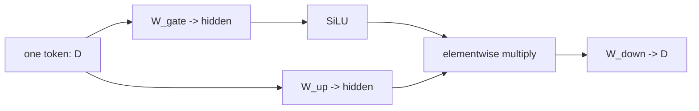

Code: [`atoms/ffn.py`](../src/smollms/atoms/ffn.py) and
[`blocks/transformer.py`](../src/smollms/blocks/transformer.py).

## Lesson E — a tiny LM closes the training loop

The complete dense model stacks blocks and predicts the next character:

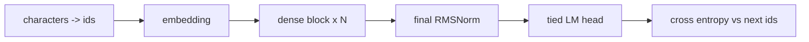

For an input window `[c0, c1, c2, c3]`, targets are `[c1, c2, c3, c4]`.
Random loss is roughly `ln(vocab_size)`; Tiny Shakespeare has 65 characters,
so a fresh model starts near 4.17. The aim is a falling validation loss and
increasingly structured samples, not literary quality.

The training loop uses AdamW, gradient clipping, a held-out contiguous tail of
the corpus, and a run logger. The model, data, and logging code live in:

```text
model.py                 dense model and generation
data/char_data.py        tokenizer and train/validation windows
train.py                 optimizer loop and architecture selection
experiment/run_logger.py durable run artifacts
```

## Lesson F — runs are the experiment, not the terminal output

Every training command creates an immutable timestamped directory. The table
below shows why each file exists:

| Artifact | Question it answers |
|---|---|
| `train_args.json` | What command and seed produced this run? |
| `model_config.json` | What model was actually built after defaults resolved? |
| `data_info.json` | Was the corpus and context window the same? |
| `metrics.jsonl` / `history.json` | Did loss improve, and when? |
| `samples.json` | Did generation change as training progressed? |
| `summary.json` | What were final/best validation loss and wall time? |
| `checkpoint.pt` | Can this exact model be generated from later? |

The corpus fingerprint guards against comparing a run on one text file with a
run on another that happens to share the same filename. New training commands
record `--seed`; this removes one major missing piece from the earlier runs.

For GitHub, the repository keeps the compact evidence bundle (configuration,
summary, corpus metadata, and samples) and excludes checkpoints and metric
streams. The comparison plots in [results.md](results.md) are committed visual
evidence. Run the suite locally when you need the complete event stream or a
checkpoint.

---

## Lesson G — Kimi: three ideas, three separate questions

The Kimi branch must not be treated as one indivisible architecture. It contains
one channel-mixer experiment and two token/depth-mixer experiments.

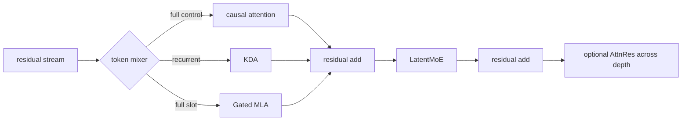

### G.1 LatentMoE: sparse channel mixing in a smaller routing space

The Kimi step-1 change is:

```text
dense:     x -> one SwiGLU -> update
LatentMoE: x -> latent -> router -> selected experts + shared expert -> update
```

Each token is projected to `d_latent`. The router scores `E` experts, keeps the
top `k`, runs only those expert MLPs, mixes their answers, and adds an always-on
shared expert. A balancing term discourages the degenerate solution where every
token picks the same expert.

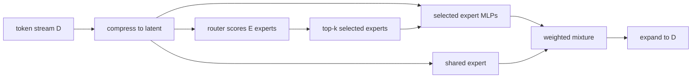

The controlled question is not "does Kimi beat dense?" It is: with the same
Kimi model and full attention, does replacing the dense channel mixer with this
LatentMoE produce a useful loss/compute tradeoff? Parameter and active-expert
counts both belong in the answer.

### G.2 Kimi Delta Attention: correct a recurrent memory, do not just add to it

Plain linear attention can accumulate outer products, but it cannot explicitly
correct an old value at the same key. KDA keeps one matrix state per head. At
each token:

```text
S       <- decay * S
old     <- key^T S
error   <- value - old
S       <- S + beta * key outer error
output  <- query^T S
output  <- output * sigmoid(output_gate)
```

The `error` is the key idea. With scalar key/query equal to one, a first value
of one stores `S=1`. A later value of three reads old=1, writes error=2, and
ends at `S=3`. The state has overwritten its prediction rather than merely
added another copy.

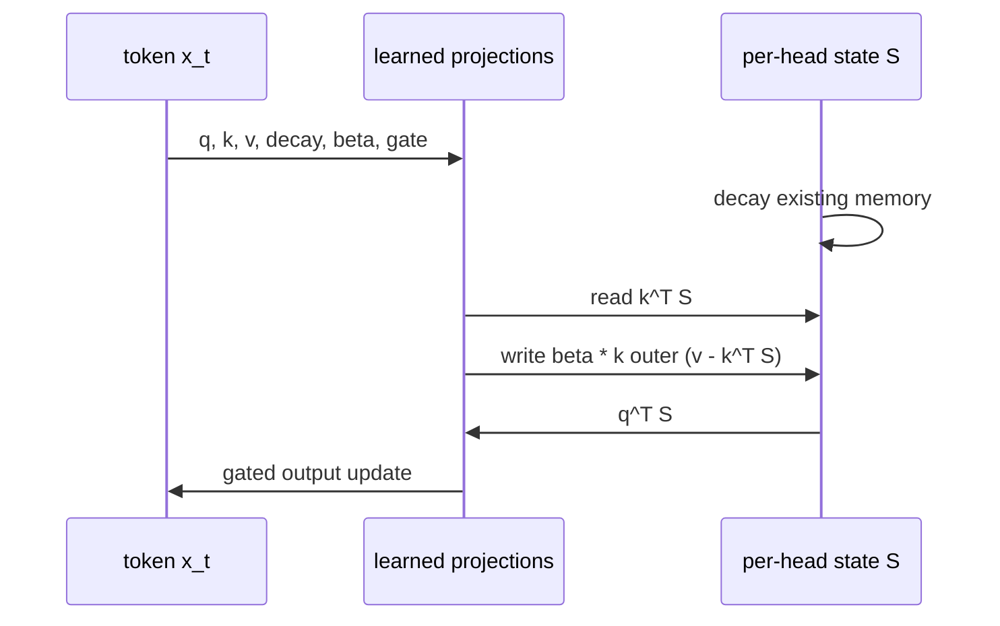

The direct loop is `O(T)` in sequence length for fixed state width, but this
Python implementation is a correctness lesson, not an optimized recurrent
kernel.

### G.3 Gated MLA: compact K/V representation, ordinary full attention read

KDA layers provide recurrent memory. Gated MLA layers keep a full causal
attention path but avoid projecting a separate full K and V directly from the
residual stream:

```text
x -> query directly
x -> compact KV latent -> reconstruct key and value
query/key -> RoPE -> causal softmax attention -> output gate -> projection
```

The compact latent is useful pedagogically because it isolates the question
"what information must a token retain for K/V?" The toy reconstructs K/V for
whole-sequence training immediately, so it does **not** yet show the decode-cache
memory savings that a real MLA system targets.

### G.4 Attention Residuals: attention across depth, not across tokens

AttnRes takes the current stream at a token and compares it with earlier block
streams at the **same token position**. It then softmaxes over depth:

```text
score(t, layer) = normalized(current_t) dot normalized(history_t, layer)
context_t = sum(depth_softmax * historical_stream_t)
output_t = current_t + sigmoid(gate(current_t) - 2) * project(context_t)
```

The `-2` bias keeps the new residual path small initially. It is neither token
attention nor a production Kimi implementation; it is the smallest version
that makes a content-dependent choice of depth state.

### G.5 Kimi comparison matrix

| Run pair | Hold fixed | Change | Interpret |
|---|---|---|---|
| step 1 dense-channel vs LatentMoE | full attention, width, depth | channel mixer | sparse routing tradeoff |
| `all_full` vs `1L1F` | Kimi MoE, width, depth, AttnRes off | token-mixer schedule | recurrent/latent mix |
| AttnRes off vs on | chosen token schedule | depth residual | whether depth reads help |

Do not enable all three changes and compare against dense. That answer would be
uninterpretable.

---

## Lesson H — GLM: selecting where to look is not the same as reading

The GLM branch uses the reusable `DeepSeekSparseAttention` atom as a DSA-like
token mixer. It has two stages:

```text
1. indexer: score each causal position cheaply
2. reader: keep the best k positions and run attention over their K/V vectors
```

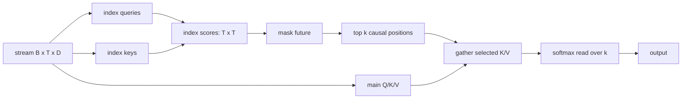

### H.1 The hard-selection gradient problem

`top_k` returns integer indices. The decision boundary is not differentiable,
so an indexer would otherwise receive no training signal for positions it did
not select. The toy adds selected index scores to the ordinary attention logits:

```text
reader_logit = main_qk_logit + selected_index_score
```

That sends gradient through the selected scorer path. It does not make hard
selection fully differentiable, and it does not make the implementation faster:
the index score matrix is still dense `T x T`.

### H.2 The GLM channel mixer

The first toy version routed every layer and was hard to interpret. The current
one uses a dense prefix, then MoE:

```text
layer 1:  token mixer + dense SwiGLU
layers 2+: token mixer + sigmoid-routed experts + shared expert
```

The router scores experts independently with sigmoid. It selects top-k experts
using a correction bias, then mixes the selected original sigmoid scores. The
correction bias is updated outside backpropagation: overloaded experts are
nudged down and underused experts up for the next batch. That keeps language
model loss free of an explicit balancing term.

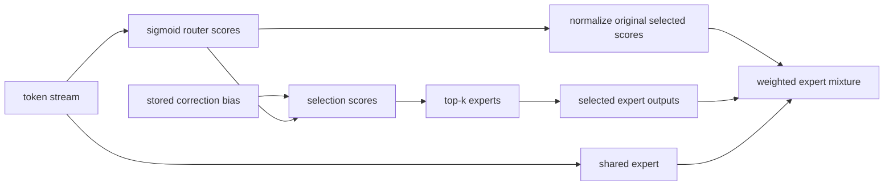

### H.3 The only clean GLM experiment

Keep the dense prefix and routed MoE identical, then switch only:

```text
DSA:   learned top-k causal token selection
dense: ordinary full causal attention
```

The existing result is documented in [results.md](results.md): dense attention
was substantially better in this small setup. That narrows the failure to this
DSA-style token selector or its interaction with the tiny setting. It does not
justify a claim about production GLM.

---

## Lesson I — DeepSeek V4: local precision plus compressed old context

Naive raw top-k selection can throw away too much history. The V4 toy instead
assigns every earlier position to exactly one branch.

For a local window of four and compression chunks of four, a query at position
15 sees:

```text
raw local:      positions 12, 13, 14, 15
raw boundary:   positions that lie after a completed memory chunk but before local
compressed:     completed chunks wholly before the boundary/local regions
future:         nothing
```

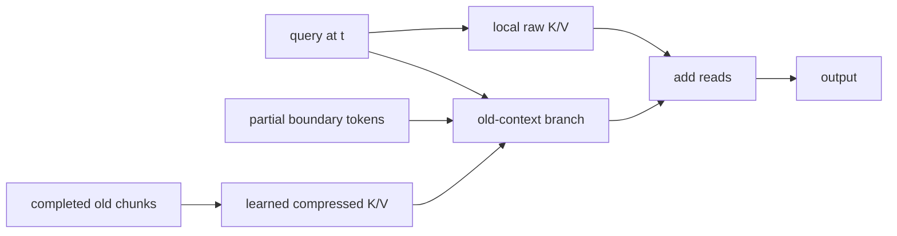

The boundary branch is not optional. A local window boundary often cuts through
a completed compression chunk. Without raw boundary tokens, one to three token
positions would disappear. If the compressed chunk were reused instead, some
positions would appear twice. The current code uses the boundary to preserve a
complete, non-overlapping causal history.

### I.1 What learned compression means here

For each completed old chunk, the toy concatenates its K/V entries and learns
one compressed K and V vector:

```text
memory_k = compress_k(concat(k_0, ..., k_chunk))
memory_v = compress_v(concat(v_0, ..., v_chunk))
```

The compressed memory cannot retain every character. It must retain features
that future queries may need. The local raw branch protects nearby exact detail;
the memory branch provides a lossy old-context summary.

### I.2 V4-style MoE: fixed bootstrap routing, then learned routing

The optional mixed channel mixer has two routing modes:

```text
first layer: token_id % n_experts chooses a fixed pair
later layers: hidden state scores experts and chooses a contextual pair
```

For token ID 6, four experts, and two selected experts, the hash layer always
chooses `[2, 3]`. The learned gate still decides how to mix those two outputs.
Later layers can choose a different pair for the same character in a different
context. A shared expert runs for every token.

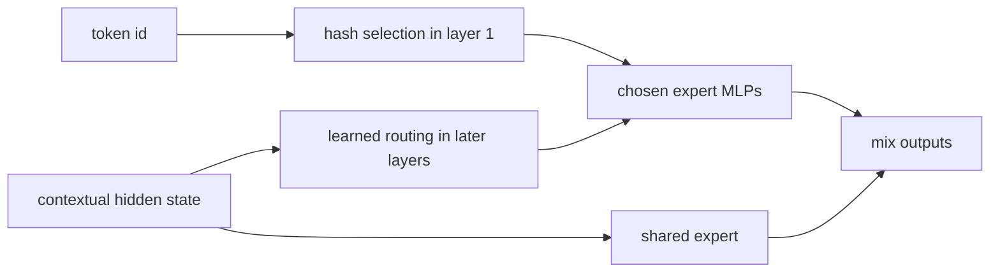

The correct ablation keeps local-compressed attention fixed and compares dense
SwiGLU with mixed MoE. The historical run did not show a loss improvement from
the larger mixed-MoE configuration, which is useful negative evidence.

---

## Lesson J — read the comparison graph before the scalar table

Validation loss is a summary, but the question determines which curves belong
together. The graph below is the project’s experiment dependency graph.

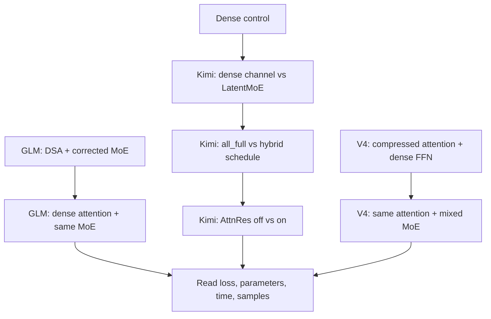

Use the result table and charts in this order:

1. Check corpus fingerprint, seed, context length, steps, optimizer, and device.
2. Check parameter count and, for MoE, active expert count.
3. Look at the validation curve. A final value can hide divergence or late
   overfitting.
4. Read samples only as qualitative evidence. A lucky short sample is not a
   better model.
5. State the narrowest conclusion supported by that pair.

The result is not "which frontier model wins on Shakespeare?" The result is a
map of which architectural ideas train cleanly, which fail under this toy
budget, and what experiment should come next.
