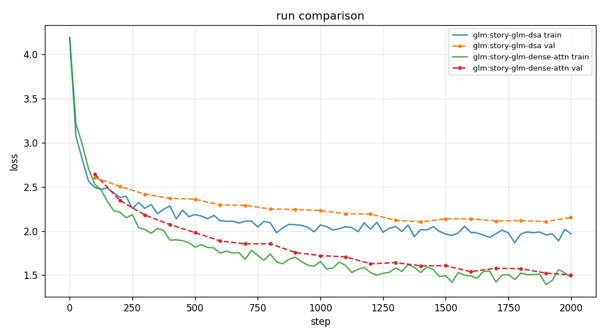
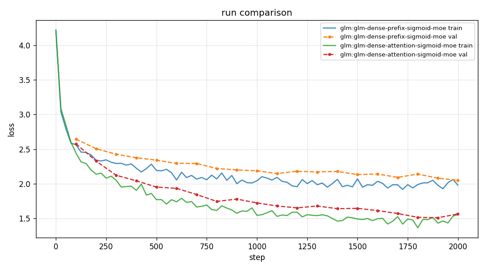
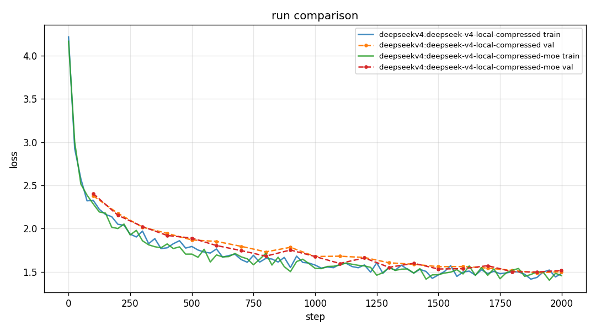
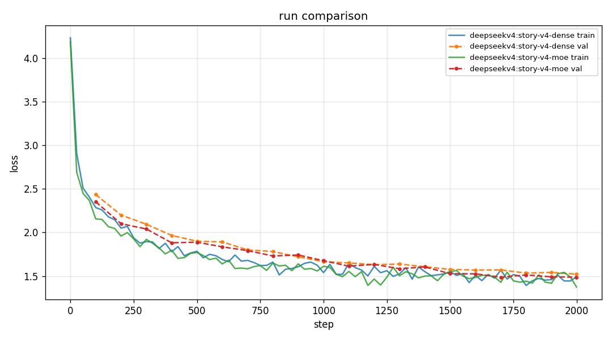
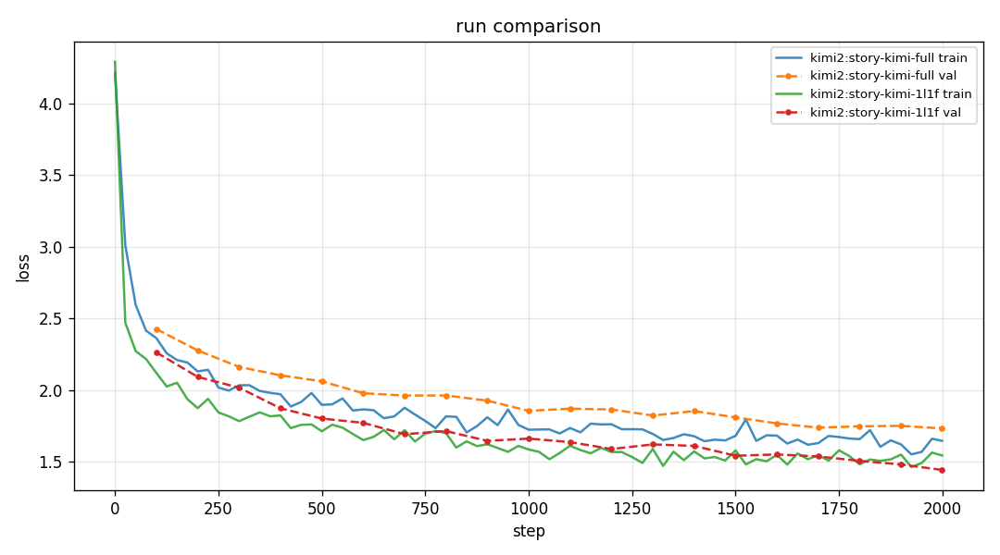
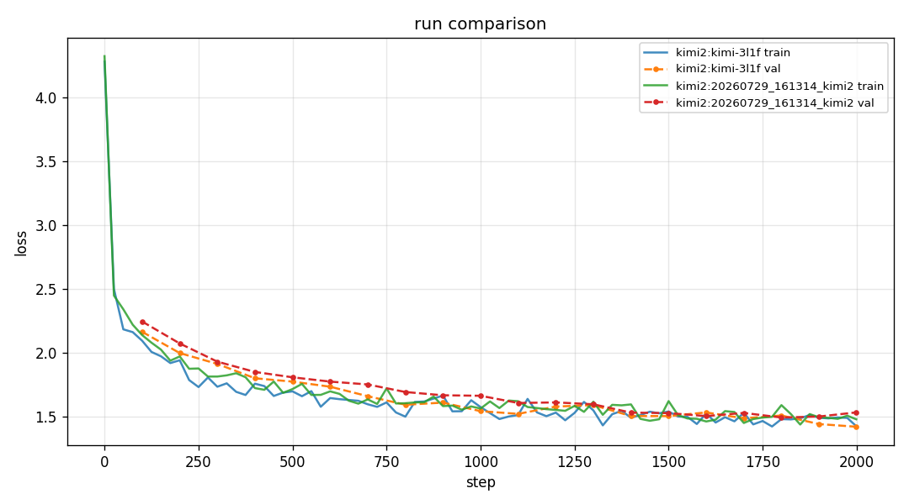

# Results: Tiny Shakespeare runs

These are saved experiment artifacts, not a leaderboard. Every number below is
read from a run's `summary.json`; every configuration is available in the run
directory. The historic runs predate seed logging, so they are evidence of what
ran, not independently reproducible multi-seed conclusions.

## Same 2,000-step CPU / 64-character setup

| Run | Parameters | Best validation loss | Final validation loss | Wall time |
|---|---:|---:|---:|---:|
| Dense control [`20260729_163601_dense_dense-2000`](../runs/20260729_163601_dense_dense-2000) | 800,256 | 1.4629 | 1.4783 | 280.5 s |
| GLM, dense attention [`20260729_170614_glm_glm-dense-attention-sigmoid-moe`](../runs/20260729_170614_glm_glm-dense-attention-sigmoid-moe) | 1,388,544 | 1.5098 | 1.5636 | 281.4 s |
| DeepSeek V4, compressed attention + dense FFN [`20260729_172111_deepseekv4_deepseek-v4-local-compressed`](../runs/20260729_172111_deepseekv4_deepseek-v4-local-compressed) | 833,024 | 1.4874 | 1.4997 | 359.0 s |
| DeepSeek V4, compressed attention + mixed MoE [`20260729_172450_deepseekv4_deepseek-v4-local-compressed-moe`](../runs/20260729_172450_deepseekv4_deepseek-v4-local-compressed-moe) | 1,289,728 | 1.4973 | 1.5144 | 456.4 s |
| GLM, DSA attention [`20260729_165343_glm_glm-dense-prefix-sigmoid-moe`](../runs/20260729_165343_glm_glm-dense-prefix-sigmoid-moe) | 1,454,080 | 2.0500 | 2.0500 | 377.5 s |

### What these runs support

- The local-plus-compressed V4 toy trained close to the dense control despite
  its different attention layout.
- With the same GLM dense-prefix sigmoid-routed MoE, dense attention was much
  better than this toy DSA implementation. That isolates the likely bottleneck
  more cleanly than comparing either GLM run with the dense control.
- The V4 mixed-MoE run had more parameters and took longer, while its best loss
  was slightly worse than V4's dense-FFN control. It is not evidence that the
  MoE schedule helps at this scale.

### What these runs do not support

- A cross-architecture ranking: parameter counts differ substantially.
- A sparsity speed claim: the GLM DSA toy still builds a dense index-score
  matrix; V4 still builds dense masks.
- A stochastic conclusion: historic runs do not record a seed and have not been
  repeated.

## Loss-curve comparisons

### Seeded GLM: DSA versus dense attention

| Run | Token mixer | Parameters | Best/final validation loss | Wall time |
|---|---|---:|---:|---:|
| [`20260730_094104_glm_story-glm-dsa`](../runs/20260730_094104_glm_story-glm-dsa) | DSA | 1,454,080 | 2.1032 / 2.1531 | 369.7 s |
| [`20260730_094716_glm_story-glm-dense-attn`](../runs/20260730_094716_glm_story-glm-dense-attn) | dense | 1,388,544 | 1.5021 / 1.5021 | 253.0 s |



Same seed, corpus, optimizer, model width/depth, dense-prefix MoE, and 2,000
steps. Dense attention won by `0.6011` best validation loss and also ran faster.
This is the strongest current result: the toy DSA selector is the limiting
component in this setup, not the corrected GLM channel mixer.

### GLM: DSA versus dense attention



The dashed validation curves are the visual form of the controlled GLM
comparison. Both runs have the same corpus fingerprint and 2,000 steps; the
small parameter-count difference remains visible in the table above.

### DeepSeek V4: dense FFN versus mixed MoE



The mixed-MoE model trained lower on the final *training* loss but did not
improve best or final validation loss. That separation is why validation loss,
not a generated sample or training loss alone, is the primary signal.

### Seeded DeepSeek V4: dense FFN versus mixed MoE

| Run | Channel mixer | Parameters | Best/final validation loss | Wall time |
|---|---|---:|---:|---:|
| [`20260730_095131_deepseekv4_story-v4-dense`](../runs/20260730_095131_deepseekv4_story-v4-dense) | dense SwiGLU | 833,024 | 1.5215 | 244.7 s |
| [`20260730_095537_deepseekv4_story-v4-moe`](../runs/20260730_095537_deepseekv4_story-v4-moe) | hash-then-routed MoE | 1,289,728 | 1.4865 | 355.1 s |



Same seed, local-compressed attention, context length, optimizer, and 2,000
steps. The mixed-MoE variant improves validation loss by `0.0350`, but adds
456,704 parameters and takes 45% longer. This is a promising toy-scale result,
not a cost-adjusted winner or an architecture-level conclusion.

## Kimi schedule comparison

### Seeded control: full attention versus `1L1F`

These runs use the same corpus fingerprint, 2,000 steps, CPU device, model
width/depth, optimizer settings, batch size, and recorded seed (`1337`).
AttnRes is off in both. The schedule changes the token mixer; parameter count
and wall time are reported rather than hidden.

| Run | Pattern | Parameters | Best/final validation loss | Wall time |
|---|---|---:|---:|---:|
| [`20260730_091818_kimi2_story-kimi-full`](../runs/20260730_091818_kimi2_story-kimi-full) | `all_full` | 387,072 | 1.7335 | 243.6 s |
| [`20260730_092224_kimi2_story-kimi-1l1f`](../runs/20260730_092224_kimi2_story-kimi-1l1f) | `1L1F` | 469,888 | 1.4441 | 1,118.6 s |



`1L1F` is better on this single seeded run, but it is 4.6x slower and has more
parameters. The right conclusion is narrow: this KDA/Gated-MLA toy can lower
validation loss at 64-character context; it is not a free replacement for dense
attention. Repeat with additional seeds before treating the gap as stable.

These two 2,000-step CPU / 64-character Kimi runs used the same width, depth,
batch size, optimizer settings, and AttnRes configuration. They differ in the
KDA/Gated-MLA schedule.

| Run | Pattern | Parameters | Best validation loss | Final validation loss |
|---|---|---:|---:|---:|
| [`20260729_161308_kimi2_kimi-3l1f`](../runs/20260729_161308_kimi2_kimi-3l1f) | `3L1F` | 527,683 | 1.4234 | 1.4234 |
| [`20260729_161314_kimi2`](../runs/20260729_161314_kimi2) | `1L1F` | 502,659 | 1.4955 | 1.5355 |

`3L1F` was better in this single historical comparison, but it also has a
different parameter count because KDA and Gated MLA are not equal-sized blocks.
The missing clean control is `all_full` at the same settings. The training CLI
now preserves that explicit schedule and records `--seed`, so the next suite
can answer that question properly.



## Re-run the controlled suite

The launcher runs dense, Kimi full/`1L1F`, GLM dense/DSA, and V4 dense/mixed
with one shared training configuration and recorded seed:

```bash
SEED=1337 DEVICE=cpu STEPS=2000 sh scripts/train_story_suite.sh
```

Use the generated folders, not this table, as the primary evidence. Repeat
with at least two more seeds before turning an observed loss gap into a general
claim.
